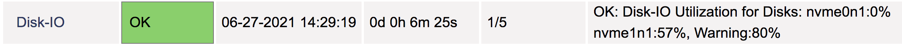

[](https://opensource.org/licenses/MIT)

## Overview
Custom Nagios plugin to monitor disk IO utilization.

Database serves (MySQL, InfluxDB, MongoDB, Elasticsearch, etc) heavily depend on disk performance as these type of  workload are disk IO bound, as such the disk IO can quickly become a bottleneck resulting in degraded performance, hense monitoring the disk performance for these types of servers is important.


This plugin will monitor the disk IO utilization of all disks connected to the server, including any *swap disks*.

## Example output

```
$ lsblk
NAME        MAJ:MIN RM  SIZE RO TYPE MOUNTPOINT
nvme0n1     259:0    0    8G  0 disk
└─nvme0n1p1 259:1    0    8G  0 part /
nvme1n1     259:2    0 1000G  0 disk /data

$ ./check_disk_io.sh -W 80
OK: Disk-IO Utilization for Disks: nvme0n1:0% nvme1n1:67%, Warning:80%

$ ./check_disk_io.sh -W 80
WARNING: Disk-IO Utilization for Disks: nvme1n1:84%;  Warning:80%
```

## Dependencies
This plugin uses 'iostat' tool to gather disk IO metrics, it can be installed as follows:
- apt-get install sysstat (Ubuntu, Debian)
- yum install sysstat (Redhat, CentOS)

## Configuration
1. Copy script to NRPE plugin directory: "/usr/lib/nagios/plugins/"
2. NRPE config entry: "/etc/nagios/nrpe.cfg"
```
command[check_disk_io]=/usr/lib/nagios/plugins/check_disk_io.sh -W 80
```
3. Example Nagios-server configuration
```
define service {
        use                      local-service
        host_name                <remote_linux_host>
        service_description      Disk-IO
        check_command            check_nrpe!check_disk_io
}

define command {
        command_name              check_nrpe
        command_line              $USER1$/check_nrpe -H $HOSTADDRESS$ -c $ARG1$
}
```

## Nagios UI screenshots



## License
Code released under the [MIT License](https://opensource.org/licenses/MIT)
